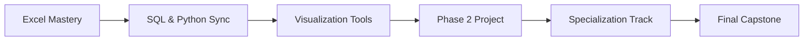

# PORA Academy Cohort 5 - Data Analytics & AI Bootcamp

A comprehensive 9-month program that takes students from Excel basics to advanced data analytics and AI specializations, with hands-on projects and industry-relevant skills development.

## 🎯 Program Overview

**Duration:** 9 months | **Format:** Live instruction + hands-on practice  
**Schedule:** Wednesdays & Thursdays, 2 hours each | **Start:** August 13, 2025 | **Completion:** May 1, 2026  
**Holidays:** Nigerian public holidays observed | **Progression:** Excel → SQL & Python → Visualization → Specialization

## 📚 Program Structure

### Phase 1: Foundations (3 months - COMPLETED)
**[📁 curriculum/01-phase-1-foundations/](curriculum/01-phase-1-foundations/)**
- Excel mastery and data analysis fundamentals
- Pivot tables, advanced functions, and interactive dashboards
- **Requirement:** ≥80% on placement test to advance

### Phase 2: Core Skills (6 months) 
**[📁 curriculum/02-phase-2-core-skills/](curriculum/02-phase-2-core-skills/)** | **Timeline:** Aug 2025 - Mar 2026
- **Weeks 1-4:** [Fundamentals](curriculum/02-phase-2-core-skills/weeks-01-04-fundamentals/) - Excel to programming bridge
- **Weeks 5-8:** [Intermediate](curriculum/02-phase-2-core-skills/weeks-05-08-intermediate/) - Advanced operations  
- **Weeks 9-12:** [Advanced](curriculum/02-phase-2-core-skills/weeks-09-12-advanced/) - Complex analytics
- **Weeks 13-16:** [Looker Studio](curriculum/02-phase-2-core-skills/weeks-13-16-visualization/) - Business dashboards
- **Weeks 17-20:** [Streamlit](curriculum/02-phase-2-core-skills/weeks-17-20-web-apps/) - Web applications
- **Weeks 21-24:** [Capstone Projects](curriculum/02-phase-2-core-skills/weeks-21-24-capstone/) - Portfolio development

### Phase 3: Specializations (3 months)
**[📁 curriculum/03-phase-3-specializations/](curriculum/03-phase-3-specializations/)** | **Timeline:** Jan - May 2026
Choose your career track:
- 🔧 **No-Code Automation** - Zapier, Make.com, Airtable, Power BI
- 🏗️ **Data Engineering** - Airflow, AWS/GCP, dbt, Snowflake
- 📊 **Advanced Analytics** - AI-driven analytics, advanced modeling
- 🧬 **ML Drug Discovery** - Pharmaceutical data analysis and prediction

## 🚀 Quick Start

### For Students
1. **Start Here:** [📚 Curriculum Overview](curriculum/README.md)
2. **Setup Tools:** [🛠️ Technical Setup](tools-setup/README.md)  
3. **Current Week:** [Week 1 - Programming Foundations](curriculum/02-phase-2-core-skills/weeks-01-04-fundamentals/week-01-programming-foundations/)
4. **Get Help:** [👥 Student Resources](student-resources/)

### For Instructors
1. **Admin Guide:** [📋 Instructor Resources](admin/instructors/)
2. **Content Creation:** [📝 Templates](templates/)
3. **Current Planning:** [Week 1 Materials](curriculum/02-phase-2-core-skills/weeks-01-04-fundamentals/week-01-programming-foundations/)

## 💼 Industry-Ready Projects

### Phase 2 Projects (Month 7)
Choose from 5 real-world scenarios:
- **[Customer Satisfaction Analysis](phase-2-core-skills/phase-2-projects/customer-satisfaction/)** - Amazon review sentiment analysis
- **[Marketing Channel Effectiveness](phase-2-core-skills/phase-2-projects/marketing-effectiveness/)** - Campaign optimization  
- **[Product Performance Analysis](phase-2-core-skills/phase-2-projects/product-performance/)** - E-commerce insights
- **[Seller Optimization](phase-2-core-skills/phase-2-projects/seller-optimization/)** - Marketplace analytics
- **[Supply Chain Analysis](phase-2-core-skills/phase-2-projects/supply-chain-logistics/)** - Logistics optimization

### Phase 3 Projects (Month 9)
Track-specific capstone projects demonstrating specialization mastery

## 🛠️ Technical Environment

| Phase | Tools & Platforms |
|-------|-------------------|
| **Phase 1** | Microsoft Excel, CSV datasets |
| **Phase 2** | VS Code (SQL), Google Colab (Python), Looker Studio, Streamlit |
| **Phase 3** | Track-specific professional tools |

## 📖 Documentation

| Document | Purpose |
|----------|---------|
| **[📚 Full Documentation](docs/)** | Complete program information |
| **[🤖 CLAUDE.md](CLAUDE.md)** | Repository structure guide |
| **[📋 Syllabus](docs/syllabus.md)** | Detailed course requirements |
| **[🎯 Assessment Guide](docs/assessment-guide.md)** | Evaluation criteria |

## 🔄 Learning Pathway

## 🌟 Key Program Features

- **🔄 Synchronized Learning:** SQL and Python taught in parallel with same datasets
- **🤖 AI Integration:** Structured curriculum for AI-assisted problem solving  
- **💼 Industry Focus:** Real business scenarios and professional-grade projects
- **🎯 Career Tracks:** Four specialized paths for different career goals
- **📱 Modern Tools:** Current industry-standard platforms and technologies

## 📞 Support & Resources

- **Technical Help:** [AI Troubleshooting Guide](phase-2-core-skills/getting-help-with-ai/)
- **Project Templates:** [Standardized Frameworks](templates/)
- **Setup Support:** [Installation & Configuration](resources/tools-setup.md)
- **Community:** Live instruction with peer collaboration

---

**Ready to transform your data analysis skills?** Start with [📖 Getting Started](docs/getting-started.md) and join the next generation of data professionals.