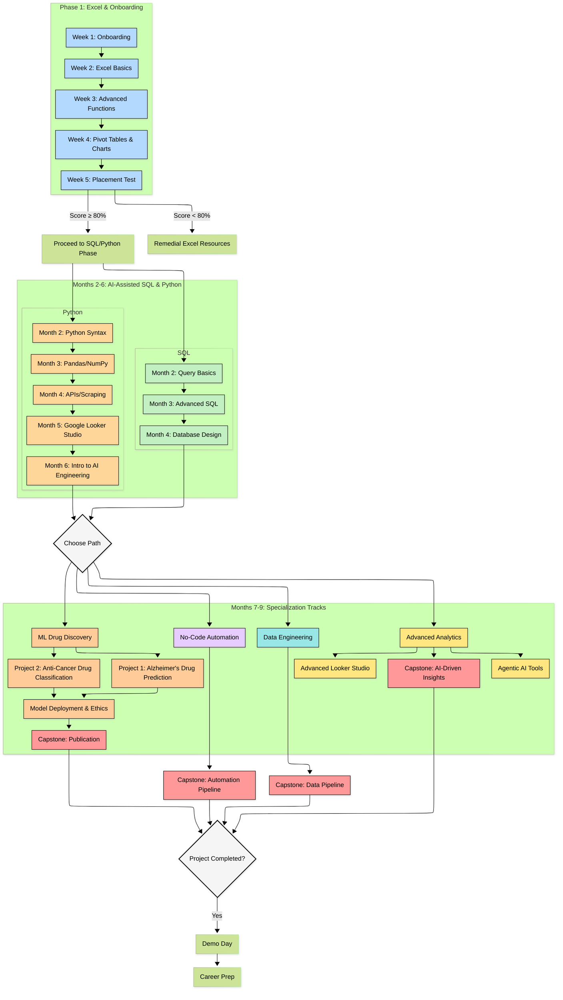
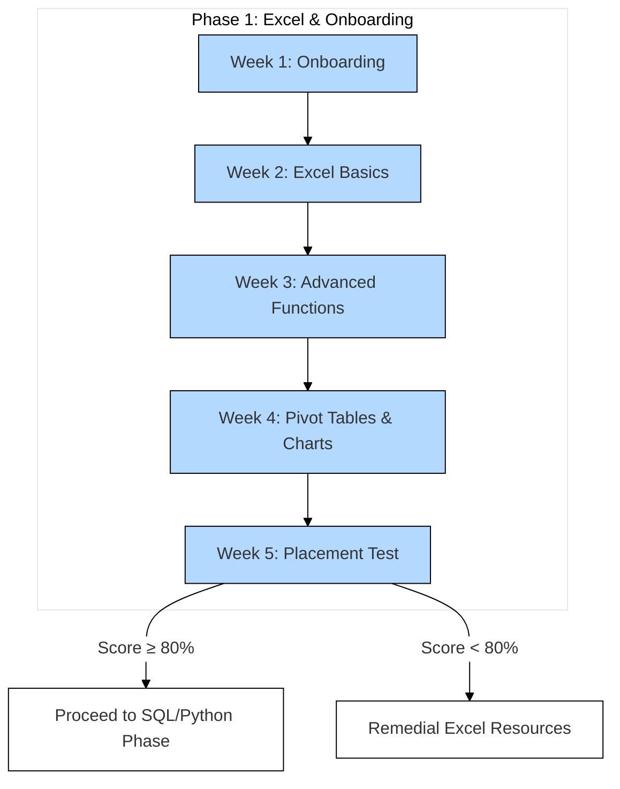
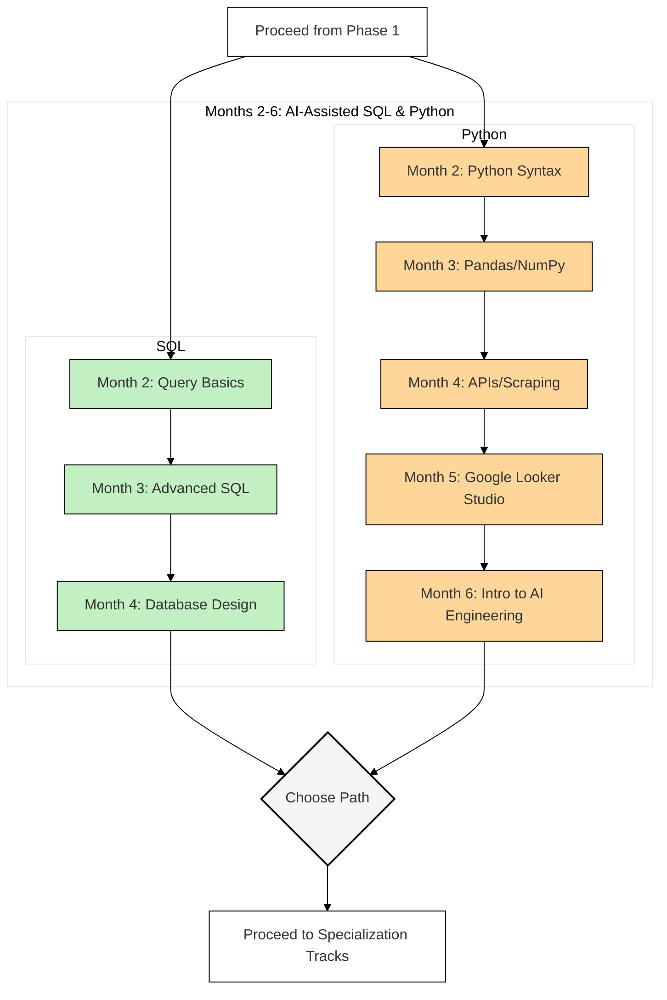
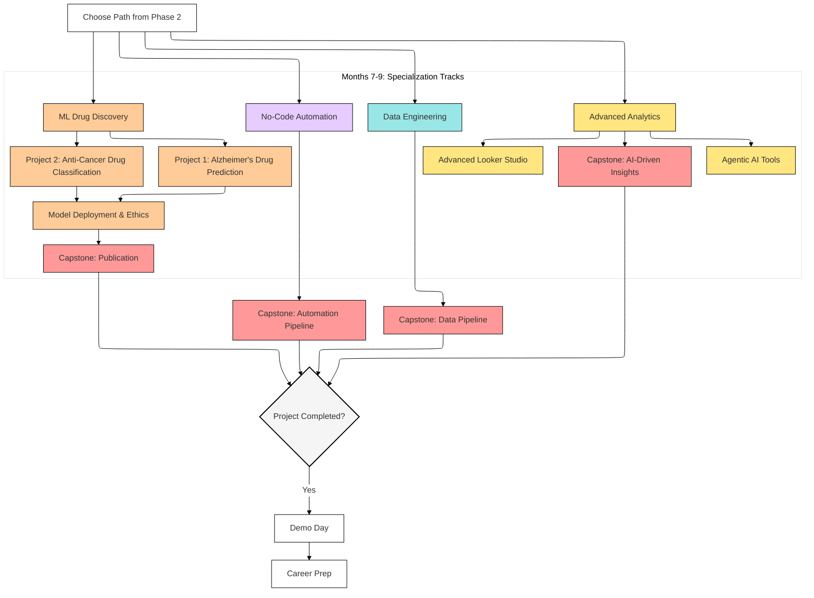

# STRUCTURE

```mermaid
---
config:
  theme: forest
  themeVariables:
    primaryColor: '#ffffff'
    primaryBorderColor: '#000000'
    lineColor: '#000000'
  look: neo
  layout: elk
---
flowchart TD
 subgraph subGraph0["Phase 1: Excel & Onboarding"]
        onboarding["Week 1: Onboarding"]
        week2["Week 2: Excel Basics"]
        week3["Week 3: Advanced Functions"]
        week4["Week 4: Pivot Tables & Charts"]
        placement["Week 5: Placement Test"]
  end
 subgraph SQL["SQL"]
        sql1["Month 2: Query Basics"]
        sql2["Month 3: Advanced SQL"]
        sql3["Month 4: Database Design"]
  end
 subgraph Python["Python"]
        py1["Month 2: Python Syntax"]
        py2["Month 3: Pandas/NumPy"]
        py3["Month 4: APIs/Scraping"]
        py4["Month 5: Google Looker Studio"]
        py5["Month 6: Intro to AI Engineering"]
  end
 subgraph subGraph3["Months 2-6: AI-Assisted SQL & Python"]
        SQL
        Python
  end
 subgraph subGraph4["Months 7-9: Specialization Tracks"]
        track1["No-Code Automation"]
        track2["Data Engineering"]
        track3["Advanced Analytics"]
        track4["ML Drug Discovery"]
        aa1["Agentic AI Tools"]
        aa2["Advanced Looker Studio"]
        cap3["Capstone: AI-Driven Insights"]
        proj1@{ label: "Project 1: Alzheimer's Drug Prediction" }
        proj2["Project 2: Anti-Cancer Drug Classification"]
        deploy["Model Deployment & Ethics"]
        publication["Capstone: Publication"]
  end
    onboarding --> week2
    week2 --> week3
    week3 --> week4
    week4 --> placement
    placement -- Score ≥ 80% --> sql_python["Proceed to SQL/Python Phase"]
    placement -- Score &lt; 80% --> remedial["Remedial Excel Resources"]
    sql_python --> sql1 & py1
    sql1 --> sql2
    sql2 --> sql3
    py1 --> py2
    py2 --> py3
    py3 --> py4
    py4 --> py5
    sql3 --> choosePath{"Choose Path"}
    py5 --> choosePath
    track3 --> aa1 & aa2 & cap3
    track4 --> proj1 & proj2
    proj1 --> deploy
    proj2 --> deploy
    deploy --> publication
    choosePath --> track1 & track2 & track3 & track4
    track1 --> cap1["Capstone: Automation Pipeline"]
    track2 --> cap2["Capstone: Data Pipeline"]
    cap1 --> projectComplete{"Project Completed?"}
    cap2 --> projectComplete
    cap3 --> projectComplete
    publication --> projectComplete
    projectComplete -- Yes --> demo["Demo Day"]
    demo --> career["Career Prep"]
    proj1@{ shape: rect}
     onboarding:::excel
     week2:::excel
     week3:::excel
     week4:::excel
     placement:::excel
     sql1:::sql
     sql2:::sql
     sql3:::sql
     py1:::python
     py2:::python
     py3:::python
     py4:::python
     py5:::python
     track1:::nocode
     track2:::dataeng
     track3:::advanced
     track4:::track4
     aa1:::advanced
     aa2:::advanced
     cap3:::capstone
     proj1:::track4
     proj2:::track4
     deploy:::track4
     publication:::capstone
     choosePath:::decision
     cap1:::capstone
     cap2:::capstone
     projectComplete:::decision
    classDef excel fill:#b3d9ff,stroke:#000
    classDef sql fill:#c2f0c2,stroke:#000
    classDef python fill:#ffd699,stroke:#000
    classDef nocode fill:#e6ccff,stroke:#000
    classDef dataeng fill:#99e6e6,stroke:#000
    classDef advanced fill:#ffe680,stroke:#000
    classDef track4 fill:#ffcc99,stroke:#000
    classDef capstone fill:#ff9999,stroke:#000
    classDef decision fill:#f5f5f5,stroke:#000,stroke-width:2px

```

```mermaid
%%{init: {'theme': 'base', 'themeVariables': { 'primaryColor': '#ffffff', 'primaryBorderColor': '#000000', 'lineColor': '#000000'}}}%%
flowchart TD
    classDef excel fill:#b3d9ff,stroke:#000;
    
    subgraph "Phase 1: Excel & Onboarding"
        onboarding["Week 1: Onboarding"]:::excel
        week2["Week 2: Excel Basics"]:::excel
        week3["Week 3: Advanced Functions"]:::excel
        week4["Week 4: Pivot Tables & Charts"]:::excel
        placement["Week 5: Placement Test"]:::excel
    end
    
    onboarding --> week2 --> week3 --> week4 --> placement
    placement -->|Score ≥ 80%| next["Proceed to SQL/Python Phase"]
    placement -->|Score < 80%| remedial["Remedial Excel Resources"]
```

```mermaid
%%{init: {'theme': 'base', 'themeVariables': { 'primaryColor': '#ffffff', 'primaryBorderColor': '#000000', 'lineColor': '#000000'}}}%%
flowchart TD
    classDef sql fill:#c2f0c2,stroke:#000;
    classDef python fill:#ffd699,stroke:#000;
    classDef decision fill:#f5f5f5,stroke:#000,stroke-width:2px;
    
    start["Proceed from Phase 1"]
    
    subgraph "Months 2-6: AI-Assisted SQL & Python"
        subgraph SQL
            sql1["Month 2: Query Basics"]:::sql
            sql2["Month 3: Advanced SQL"]:::sql
            sql3["Month 4: Database Design"]:::sql
        end
        
        subgraph Python
            py1["Month 2: Python Syntax"]:::python
            py2["Month 3: Pandas/NumPy"]:::python
            py3["Month 4: APIs/Scraping"]:::python
            py4["Month 5: Google Looker Studio"]:::python
            py5["Month 6: Intro to AI Engineering"]:::python
        end
    end
    
    start --> sql1 & py1
    sql1 --> sql2 --> sql3
    py1 --> py2 --> py3 --> py4 --> py5
    
    sql3 & py5 --> choosePath{"Choose Path"}:::decision
    choosePath --> next["Proceed to Specialization Tracks"]
```

```mermaid
---
config:
  theme: base
  themeVariables:
    primaryColor: '#ffffff'
    primaryBorderColor: '#000000'
    lineColor: '#000000'
  layout: elk
---
flowchart TD
 subgraph subGraph0["Months 7-9: Specialization Tracks"]
        track1["No-Code Automation"]
        track2["Data Engineering"]
        track3["Advanced Analytics"]
        track4["ML Drug Discovery"]
        aa1["Agentic AI Tools"]
        aa2["Advanced Looker Studio"]
        cap3["Capstone: AI-Driven Insights"]
        proj1@{ label: "Project 1: Alzheimer's Drug Prediction" }
        proj2["Project 2: Anti-Cancer Drug Classification"]
        deploy["Model Deployment & Ethics"]
        publication["Capstone: Publication"]
  end
    track3 --> aa1 & aa2 & cap3
    track4 --> proj1 & proj2
    proj1 --> deploy
    proj2 --> deploy
    deploy --> publication
    start["Choose Path from Phase 2"] --> track1 & track2 & track3 & track4
    track1 --> cap1["Capstone: Automation Pipeline"]
    track2 --> cap2["Capstone: Data Pipeline"]
    cap1 --> projectComplete{"Project Completed?"}
    cap2 --> projectComplete
    cap3 --> projectComplete
    publication --> projectComplete
    projectComplete -- Yes --> demo["Demo Day"]
    demo --> career["Career Prep"]
    proj1@{ shape: rect}
     track1:::nocode
     track2:::dataeng
     track3:::advanced
     track4:::track4
     aa1:::advanced
     aa2:::advanced
     cap3:::capstone
     proj1:::track4
     proj2:::track4
     deploy:::track4
     publication:::capstone
     cap1:::capstone
     cap2:::capstone
     projectComplete:::decision
    classDef nocode fill:#e6ccff,stroke:#000
    classDef dataeng fill:#99e6e6,stroke:#000
    classDef advanced fill:#ffe680,stroke:#000
    classDef track4 fill:#ffcc99,stroke:#000
    classDef capstone fill:#ff9999,stroke:#000
    classDef decision fill:#f5f5f5,stroke:#000,stroke-width:2px

```