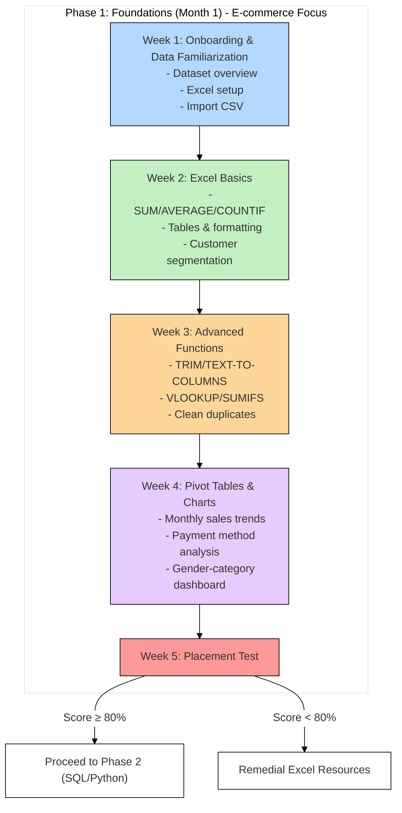

# Foundations

### **Phase 1: Foundations (Month 1)**

**Dataset**: [Kaggle E-commerce Dataset](https://www.kaggle.com/datasets/mervemenekse/ecommerce-dataset)

**Tools**: Excel

---

### **Week 1: Onboarding & Data Familiarization**

**Teacher: @Annet, and everyone**

**Topics**:

1. Introduction to data analytics and th inie e-commerce domain.
2. Dataset overview: Column meanings (`Order_Date`, `Gender`, `Profit`, etc.).
3. Excel setup: Import CSV, basic navigation (rows, columns, sheets).

**Exercises**:

1. **Download & Explore**:
    - Download the dataset from Kaggle.
    - Identify 3 key business questions using column descriptions (e.g., "Which product category has the highest sales?").
2. **Data Import**:
    - Import `E-commerce Dataset.csv` into Excel.
    - Use filters to view only "Critical" `Order_Priority` entries.

---

### **Week 2: Excel Basics**

Teacher: @Samuel Amienghemen 

**Topics**:

1. Core formulas: `SUM`, `AVERAGE`, `COUNTIF`.
2. Tables and conditional formatting.

**Exercises**:

1. **Sales Analysis**:
    - Calculate total annual sales: `=SUM(Sales column)`
    - Find average shipping cost: `=AVERAGE(Shipping_Cost column)`.
2. **Customer Segmentation**:
    - Use `COUNTIF` to count female customers: `=COUNTIF(Gender column, "F")`.
    - Convert raw data to an Excel table and sort by `Quantity` descending.
3. **Formatting**:
    - Highlight "Critical" in red under `Order_Priority`.

---

### **Week 3: Advanced Functions**

**Teacher: @BECKY OLA** 

**Topics**:

1. Data cleaning: `TRIM`, `TEXT-TO-COLUMNS`, removing duplicates.
2. Lookup functions: `VLOOKUP`, `SUMIFS`.

**Exercises**:

1. **Clean Product Categories**:
    - Use `TRIM` on `Product_Category` to remove extra spaces.
    - Split combined categories (e.g., "Electronics_Mobile") using `TEXT-TO-COLUMNS` with "_" delimiter.
2. **Customer Analysis**:
    - Remove duplicate `Customer_Id` entries.
3. **Customer Analysis**:
    - Use `SUMIFS` to calculate total sales for "Mobile" vs. "Web" (`Device_Type`).

---

### **Week 4: Pivot Tables & Charts**

Teacher: @Samuel Amienghemen 

**Topics**:

1. Pivot Tables: Summarization, grouping, slicers.
2. Charts: Dynamic dashboards.

**Exercises**:

1. **Monthly Sales Trends**:
    - Create a pivot table grouping `Order_Date` by month.
    - Compare `Sales` and `Profit` per month.
2. **Payment Method Analysis**:
    - Build a pivot table showing the average `Discount` by `Payment_method`.
3. **Gender Distribution Dashboard**:
    - Use a pivot chart to visualize `Gender` distribution across `Product_Category`.

### **Week 5: Placement Test (E-commerce Scenario)**

**Instructions**: Answer all questions. Choose the best option.

---

### **Easy Questions (5)**

1. **Which Excel formula calculates total sales for the "Sales" column (Column I)?**
    
    a) `=COUNT(I2:I1000)`
    
    b) `=SUM(I2:I1000)`
    
    c) `=AVERAGE(I2:I1000)`
    
    d) `=MAX(I2:I1000)`
    
2. **The "Gender" column (Column E) contains values "M" and "F". Which formula counts female customers?**
    
    a) `=COUNTIF(E2:E1000, "F")`
    
    b) `=SUMIF(E2:E1000, "F")`
    
    c) `=COUNT(E2:E1000)`
    
    d) `=FILTER(E2:E1000, "F")`
    
3. **Which Excel feature highlights "Critical" orders in red under "Order_Priority"?**
    
    a) Pivot Table
    
    b) Conditional Formatting
    
    c) Data Validation
    
    d) VLOOKUP
    
4. **To import the dataset into Excel, you should use:**
    
    a) Copy-paste directly into a sheet
    
    b) **Data > From Text/CSV**
    
    c) Insert a PDF
    
    d) Type manually
    
5. **The "Device_Type" column (Column F) shows whether customers used "Mobile" or "Web". Which tool summarizes total sales by device?**
    
    a) VLOOKUP
    
    b) Pivot Table
    
    c) TRIM
    
    d) CONCATENATE
    

---

### **Intermediate Questions (5)**

1. **You need to map "Product" (Column H) to its "Product_Category" (Column G). Which function should you use?**
    
    a) `=SUMIFS(G2:G1000, H2:H1000, "ProductX")`
    
    b) `=VLOOKUP(H2, G2:H1000, 2, FALSE)`
    
    c) `=COUNTIF(G2:G1000, "Electronics")`
    
    d) `=AVERAGEIF(H2:H1000, "ProductX")`
    
2. **Which formula calculates total sales for "Mobile" users in "Electronics" category?**
    
    a) `=SUMIFS(I2:I1000, F2:F1000, "Mobile", G2:G1000, "Electronics")`
    
    b) `=SUM(I2:I1000)`
    
    c) `=COUNTIF(F2:F1000, "Mobile")`
    
    d) `=AVERAGEIF(G2:G1000, "Electronics")`
    
3. **The "Product_Category" column has entries like "Electronics_Mobile". To split these into two columns, use:**
    
    a) Conditional Formatting
    
    b) **Data > Text-to-Columns > Delimiter "_"**
    
    c) TRIM
    
    d) Pivot Table
    
4. **A pivot table shows "Sales" by "Order_Date" grouped monthly. Which step is required to group dates?**
    
    a) Use `=MONTH()` formula first
    
    b) Right-click dates in pivot table > Group > Months
    
    c) Sort the columns alphabetically
    
    d) Delete the "Order_Date" column
    
5. **Which function removes extra spaces in "Customer_Login_type" (Column G)?**
    
    a) `=CLEAN()`
    
    b) `=TRIM()`
    
    c) `=UPPER()`
    
    d) `=LEN()`
    

---

### **Hard Questions (5)**

1. **Which formula calculates average profit for orders with "Shipping_Cost" > $10 and "Discount" < 5%?**
    
    a) `=AVERAGEIFS(K2:K1000, M2:M1000, ">10", J2:J1000, "<0.05")`
    
    b) `=SUM(K2:K1000)/COUNT(K2:K1000)`
    
    c) `=AVERAGE(K2:K1000)`
    
    d) `=COUNTIFS(M2:M1000, ">10", J2:J1000, "<0.05")`
    
2. **To flag products with "Profit" < 0 as "Loss", use:**
    
    a) `=IF(K2<0, "Loss", "Profit")`
    
    b) `=SUMIF(K2:K1000, "<0")`
    
    c) `=VLOOKUP(K2, "Profit", 2)`
    
    d) `=COUNTIF(K2:K1000, "<0")`
    
3. **A pivot table groups "Order_Date" by month. How would you add a calculated field for "Profit per Sale"?**
    
    a) **PivotTable Analyze > Fields, Items & Sets > Calculated Field**
    
    b) Use `=Profit/Sales` outside the pivot table
    
    c) Sort the pivot table by "Sales"
    
    d) Delete the pivot table and rebuild
    
4. **The formula `=VLOOKUP(H2, G2:H1000, 2, FALSE)` returns #N/A. What is the issue?**
    
    a) Column index should be `1`
    
    b) The lookup value isn’t in the first column of the range
    
    c) Replace `FALSE` with `TRUE`
    
    d) Use `SUMIF` instead
    
5. **To create a dynamic dashboard showing "Sales by Gender" and "Device_Type", which Excel tool connects multiple charts?**
    
    a) Slicers
    
    b) Sparklines
    
    c) Data Validation
    
    d) Goal Seek
    

---

### **Answer Key**

| **Difficulty** | **Question Numbers** | **Correct Answers** |
| --- | --- | --- |
| Easy | 1–5 | b, a, b, b, b |
| Intermediate | 6–10 | b, a, b, b, b |
| Hard | 11–15 | a, a, a, b, a |

---

[Phase 1 - Project](Phase%201%20-%20Project%20229bb620a8a6806e9e74c88ab0848860.md)